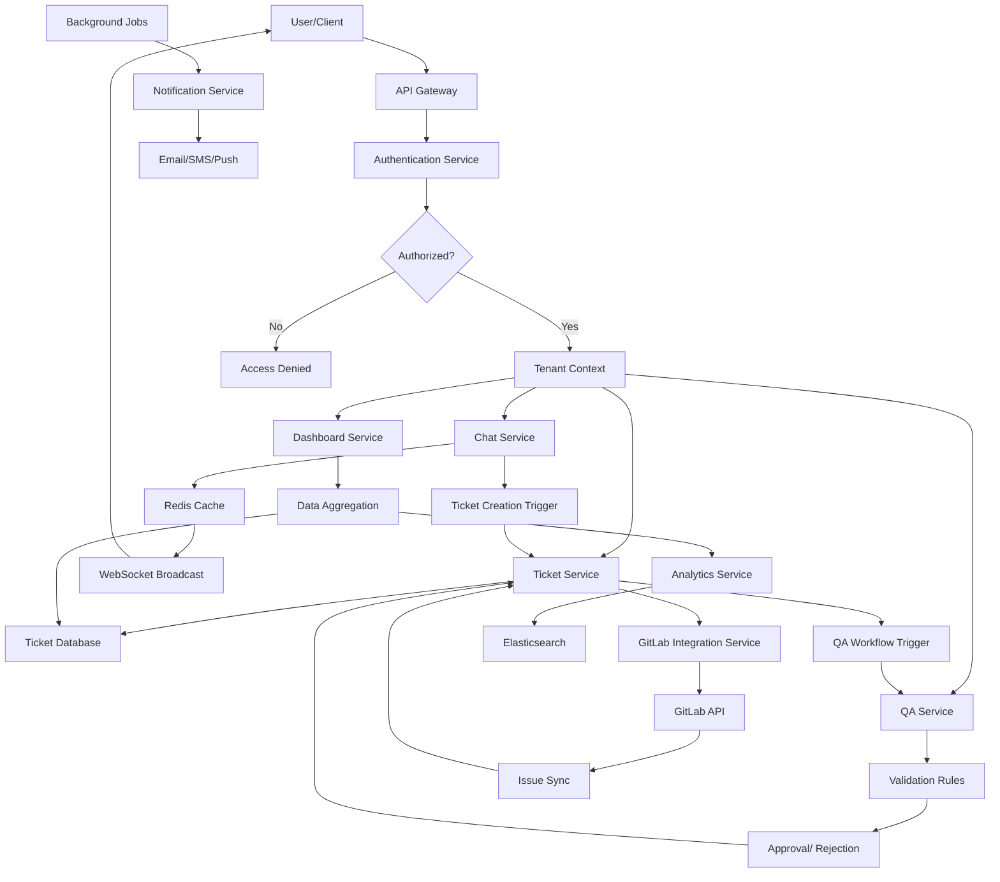

# Multi-Tenant SaaS Platform Architecture Design

## Overview
This document outlines the system architecture for a multi-tenant SaaS platform supporting real-time chat, ticket creation from chat, QA validation workflow, GitLab issue integration, multi-company support, and role-based dashboards.

## System Architecture

### High-Level Architecture
The platform follows a microservices architecture deployed on Kubernetes, with multi-tenancy implemented through database schema isolation and tenant-aware services.

```
┌─────────────────┐    ┌─────────────────┐    ┌─────────────────┐
│   API Gateway   │    │ Authentication  │    │   Load Balancer │
│   (Kong/Traefik)│    │   Service       │    │                 │
└─────────────────┘    └─────────────────┘    └─────────────────┘
         │                       │                       │
         └───────────────────────┼───────────────────────┘
                                 │
                    ┌─────────────────────┐
                    │   Service Mesh      │
                    │   (Istio/Linkerd)   │
                    └─────────────────────┘
                                 │
         ┌───────────────────────┼───────────────────────┐
         │                       │                       │
┌─────────────────┐    ┌─────────────────┐    ┌─────────────────┐
│   Chat Service  │    │ Ticket Service  │    │   QA Service    │
│                 │    │                 │    │                 │
└─────────────────┘    └─────────────────┘    └─────────────────┘
         │                       │                       │
         └───────────────────────┼───────────────────────┘
                                 │
                    ┌─────────────────────┐
                    │   Shared Services   │
                    │                     │
                    └─────────────────────┘
                                 │
         ┌───────────────────────┼───────────────────────┐
         │                       │                       │
┌─────────────────┐    ┌─────────────────┐    ┌─────────────────┐
│ User Management│    │ Dashboard       │    │ GitLab          │
│ Service        │    │ Service         │    │ Integration     │
└─────────────────┘    └─────────────────┘    └─────────────────┘
                                 │
                    ┌─────────────────────┐
                    │   Data Layer        │
                    │                     │
                    └─────────────────────┘
         ┌───────────────────────┼───────────────────────┐
         │                       │                       │
┌─────────────────┐    ┌─────────────────┐    ┌─────────────────┐
│   PostgreSQL    │    │     Redis       │    │   Elasticsearch │
│   (Primary DB)  │    │   (Cache/Chat)  │    │   (Search)      │
└─────────────────┘    └─────────────────┘    └─────────────────┘
```

## Module Breakdown

### 1. User Management Module
- **Responsibilities**: User registration, authentication, authorization, role assignment
- **Features**: Multi-tenant user isolation, SSO integration, password policies
- **Components**: User service, Role service, Permission service

### 2. Company/Tenant Management Module
- **Responsibilities**: Tenant creation, configuration, billing, resource allocation
- **Features**: Tenant-specific settings, usage tracking, subscription management
- **Components**: Tenant service, Billing service, Configuration service

### 3. Chat Module
- **Responsibilities**: Real-time messaging, chat rooms, message history
- **Features**: WebSocket connections, message encryption, file sharing
- **Components**: Chat service, WebSocket gateway, Message storage

### 4. Ticketing Module
- **Responsibilities**: Ticket creation, assignment, tracking, resolution
- **Features**: SLA management, priority levels, automated routing
- **Components**: Ticket service, Workflow engine, Notification service

### 5. QA Validation Module
- **Responsibilities**: Quality assurance workflows, validation rules, approval processes
- **Features**: Automated checks, manual review queues, compliance tracking
- **Components**: QA service, Validation engine, Audit service

### 6. GitLab Integration Module
- **Responsibilities**: Issue synchronization, webhook handling, bidirectional updates
- **Features**: Issue creation from tickets, status synchronization, comment syncing
- **Components**: GitLab API client, Webhook handler, Mapping service

### 7. Dashboard Module
- **Responsibilities**: Role-based UI rendering, data aggregation, real-time updates
- **Features**: Customizable widgets, reporting, analytics
- **Components**: Dashboard service, Widget service, Analytics service

## Services Required

### Core Services
1. **API Gateway**: Request routing, rate limiting, authentication
2. **Authentication Service**: JWT token management, OAuth integration
3. **Authorization Service**: RBAC, permission checking
4. **Tenant Service**: Multi-tenancy management
5. **User Service**: User CRUD operations
6. **Chat Service**: Real-time messaging
7. **Ticket Service**: Issue tracking
8. **QA Service**: Validation workflows
9. **GitLab Integration Service**: External system integration
10. **Dashboard Service**: UI data provision

### Supporting Services
11. **Notification Service**: Email, SMS, push notifications
12. **File Storage Service**: Document management
13. **Search Service**: Full-text search capabilities
14. **Analytics Service**: Data aggregation and reporting
15. **Background Job Service**: Asynchronous task processing
16. **Monitoring Service**: Logging, metrics, alerting

## Technology Stack

### Frontend
- **Framework**: React 18+ with TypeScript
- **State Management**: Redux Toolkit / Zustand
- **UI Library**: Material-UI / Ant Design
- **Real-time**: Socket.io client
- **Build Tool**: Vite
- **Testing**: Jest, React Testing Library

### Backend
- **Runtime**: Node.js 18+ with TypeScript
- **Framework**: Express.js / Fastify
- **API**: REST + GraphQL
- **Real-time**: Socket.io / WebSockets
- **Authentication**: JWT + OAuth 2.0
- **Validation**: Joi / Zod
- **Testing**: Jest, Supertest

### Database & Storage
- **Primary Database**: PostgreSQL 15+
- **Cache**: Redis 7+
- **Search**: Elasticsearch 8+
- **File Storage**: AWS S3 / MinIO
- **ORM**: Prisma / TypeORM

### Infrastructure
- **Containerization**: Docker
- **Orchestration**: Kubernetes
- **Service Mesh**: Istio
- **API Gateway**: Kong / Traefik
- **Load Balancer**: NGINX / HAProxy
- **Monitoring**: Prometheus + Grafana
- **Logging**: ELK Stack
- **CI/CD**: GitLab CI / GitHub Actions

### External Integrations
- **GitLab API**: REST API integration
- **Email Service**: SendGrid / AWS SES
- **SMS Service**: Twilio
- **Payment**: Stripe

## Data Flow Diagram



## Security Considerations
- Multi-tenant data isolation
- End-to-end encryption for chat
- Role-based access control
- API rate limiting
- Input validation and sanitization
- Regular security audits

## Scalability Considerations
- Horizontal scaling of services
- Database read replicas
- CDN for static assets
- Message queuing for async processing
- Caching strategies

## Deployment Strategy
- Blue-green deployments
- Feature flags for gradual rollouts
- Database migrations with rollback capability
- Automated testing in CI/CD pipeline