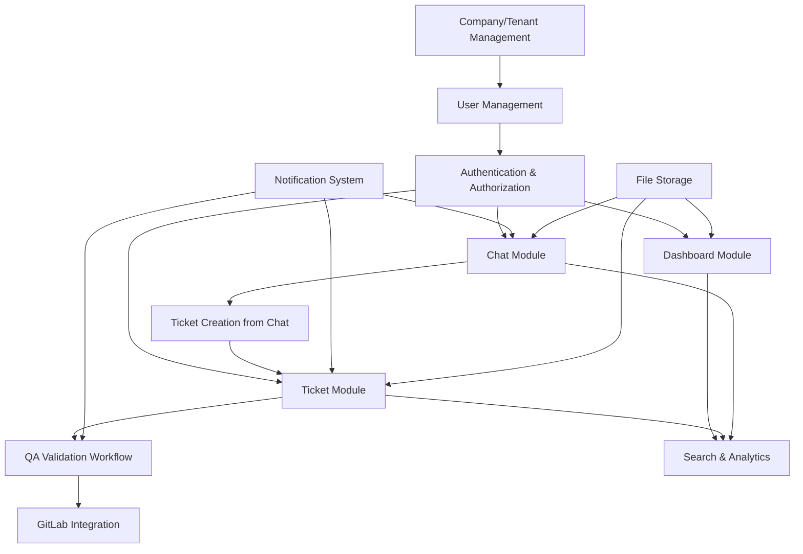

# Platform Modules and Features Breakdown

## Feature List

### Core Features
1. **Multi-Tenant User Management**
   - User registration and authentication
   - Role-based access control (RBAC)
   - User profile management
   - Multi-company user isolation

2. **Company/Tenant Management**
   - Tenant creation and configuration
   - Subscription and billing management
   - Resource allocation and limits
   - Tenant-specific settings

3. **Real-Time Chat System**
   - WebSocket-based messaging
   - Chat rooms and direct messages
   - Message history and search
   - File sharing and attachments
   - Message encryption

4. **Ticket Creation from Chat**
   - Automatic ticket generation from chat conversations
   - Manual ticket creation
   - Ticket assignment and routing
   - Ticket status tracking

5. **QA Validation Workflow**
   - Automated validation rules
   - Manual review processes
   - Approval/rejection workflows
   - Compliance tracking and auditing

6. **GitLab Issue Integration**
   - Bidirectional issue synchronization
   - Webhook handling for GitLab events
   - Issue creation from tickets
   - Status and comment syncing

7. **Role-Based Dashboards**
   - Customizable dashboard widgets
   - Real-time data updates
   - Analytics and reporting
   - Role-specific views and permissions

### Supporting Features
8. **Authentication & Authorization**
   - JWT token management
   - OAuth 2.0 integration
   - SSO support
   - Password policies and security

9. **Notification System**
   - Email notifications
   - SMS and push notifications
   - In-app notifications
   - Customizable notification preferences

10. **File Storage and Management**
    - Secure file uploads
    - Version control for documents
    - Access control for files
    - Integration with cloud storage

11. **Search and Analytics**
    - Full-text search across content
    - Advanced filtering and sorting
    - Data aggregation and reporting
    - Export capabilities

12. **API and Integrations**
    - RESTful API endpoints
    - GraphQL API for flexible queries
    - Third-party integrations
    - Webhook support

## Module Dependencies

The following diagram shows the dependencies between modules:

### Dependency Explanation
- **Company/Tenant Management** is foundational and required by all other modules
- **User Management** depends on Company/Tenant for multi-tenancy context
- **Authentication & Authorization** is required by most user-facing modules
- **Chat Module** enables ticket creation and feeds into analytics
- **Ticket Module** integrates with QA workflows and GitLab
- **Dashboard Module** aggregates data from multiple sources
- **Supporting modules** (Notifications, File Storage) are used across multiple core modules

## MVP vs Advanced Features

### MVP Features (Core Functionality)
| Feature | Priority | Module | Rationale |
|---------|----------|--------|-----------|
| Multi-Tenant User Management | High | User Management | Essential for SaaS operation |
| Company/Tenant Management | High | Company/Tenant | Foundation for multi-tenancy |
| Authentication & Authorization | High | Auth | Security requirement |
| Real-Time Chat System | High | Chat | Primary user interaction |
| Ticket Creation from Chat | High | Ticket | Core workflow |
| Basic Role-Based Dashboards | High | Dashboard | User interface |
| Notification System | Medium | Notifications | User engagement |

**MVP Scope:** Basic chat, ticket creation, user management, and dashboards. Estimated development time: 3-4 months.

### Advanced Features (Post-MVP)
| Feature | Priority | Module | Rationale |
|---------|----------|--------|-----------|
| QA Validation Workflow | Medium | QA | Process automation |
| GitLab Issue Integration | Medium | GitLab Integration | Developer workflow |
| Advanced Dashboard Analytics | Medium | Dashboard | Business intelligence |
| File Storage and Management | Low | File Storage | Document handling |
| Full-Text Search | Low | Search | Enhanced UX |
| API and Third-Party Integrations | Low | API | Ecosystem expansion |
| Advanced Notification Rules | Low | Notifications | Customization |

**Advanced Features Timeline:**
- **Phase 1 (Post-MVP):** QA Workflows, GitLab Integration, Enhanced Dashboards
- **Phase 2:** File Management, Advanced Search, API Expansions
- **Phase 3:** Advanced Analytics, Custom Integrations

### Feature Implementation Roadmap

#### Month 1-2: Foundation
- Multi-tenant infrastructure
- User management and authentication
- Basic chat functionality

#### Month 3-4: Core Workflows
- Ticket system integration
- Basic dashboards
- Notification system

#### Month 5-6: Advanced Features
- QA validation workflows
- GitLab integration
- Enhanced analytics

#### Month 7+: Ecosystem Expansion
- File management
- Advanced search
- Third-party integrations

### Technical Dependencies for MVP
- Database schema for multi-tenancy
- WebSocket implementation for chat
- Basic API gateway
- Authentication middleware
- Containerization setup

### Success Metrics
- **MVP:** 1000+ active users, 95% uptime, <2s response time
- **Advanced:** 10,000+ users, advanced workflow adoption, integration usage